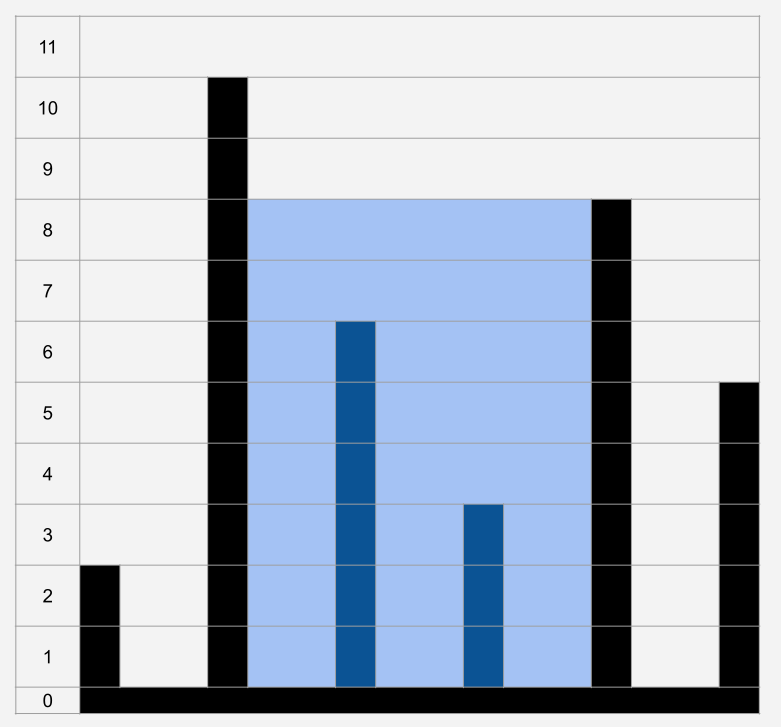

# Container With Most Water

Задача

Имеется контейнер, в нем перегородки разной высоты. Найти максимальную площадь сечения воды которая умещается между двумя перегородками.
Перегородки имеют нулевую толщину, расстояние между ними равно 1.

Здесь всё очень просто. Считаем максимальную площадь между крайними перегородками. Переходим от меньшей перегородки к следующей. Выполняем это действие до тех пор пока перегородки не встретятся. В процессе сохраняем максимальную площадь.
